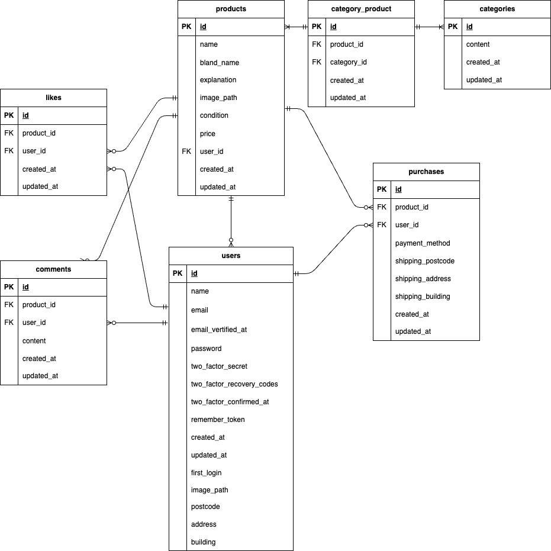

# Flea market(フリーマーケット)

## 環境構築

### Docker ビルド

1. git リポジトリをクローンする

```bash
mkdir test-unokuchi
cd test-unokuchi
git clone git@github.com:kasumiunokuchi-afk/flea-market.git
cd flea-market
```

2. Docker をビルドする

```bash
docker-compose up -d --build
```

### Laravel 環境構築

1. php コンテナにログイン

```bash
docker-compose exec php bash
```

2. パッケージをインストール

```bash
composer install
```

3. 環境変数の設定

```bash
cp .env.example .env
exit
code .
```

.env 作成後、vscode を使用して以下の変更を行う。

```
修正ファイル： .env

<変更前>
DB_CONNECTION=mysql
DB_HOST=127.0.0.1
DB_PORT=3306
DB_DATABASE=laravel
DB_USERNAME=root
DB_PASSWORD=

<変更後>
DB_CONNECTION=mysql
DB_HOST=mysql
DB_PORT=3306
DB_DATABASE=laravel_db
DB_USERNAME=laravel_user
DB_PASSWORD=laravel_pass

```

4. php コンテナに再ログイン

```bash
docker-compose exec php bash
```

5. アプリケーション用 KEY の作成

```bash
php artisan key:generate
```

6. DB のマイグレーション

```bash
php artisan migrate
```

7. ストレージ設定

画像表示のため、以下のコマンドを実行してください。

```bash
php artisan storage:link
```

8.  シーディングの実行

```bash
php artisan db:seed
```
- アップロードされた画像は `storage/app/public` に保存されます
- 公開用リンクは `public/storage` です

## 使用技術（実行環境）

- PHP : 8.1.33
- Laravel : 8.83.8
- mysql : 8.0.26
- nginx : 1.21.1
- fortify : 1.19.1

## ER 図




## URL

- 開発環境
  http://localhost/

- phpMyAdmin
  http://localhost:8080/

